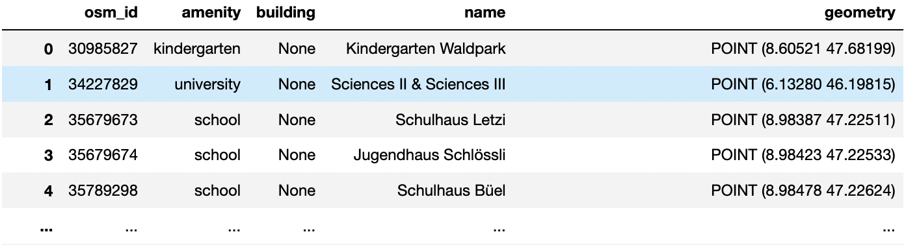

# osm-flex


[](https://github.com/osm-flex/osm-flex)
[](https://github.com/osm-flex/osm-flex)
[](https://badge.fury.io/py/osm-flex) 
[](https://pypistats.org/packages/osm-flex)
[](https://osm-flex.readthedocs.io/en/latest/?badge=latest)
[](https://fair-software.eu)
[](https://doi.org/10.5281/zenodo.8082963)

Python package for flexible data extraction from OpenStreetMap. This packages allows to 

1. download OSM data dumps
2. [optional] clip to desired shape
3. extract specific features to geodataframes
4. [optional] simplify results based on geospatial operations

## Documentation

Please refer to the [ReadTheDocs](https://osm-flex.readthedocs.io/en/latest/?badge=latest) of this project for the full documentation of all functions.

## Installation

osm-flex is available from the [Python Package Index (PyPI)](https://pypi.org/project/osm-flex/) and from [conda-forge](https://anaconda.org/conda-forge/osm-flex).

To manage all dependencies automatically, we recommend creating a new Conda environment:
```
conda create -n osm-flex -c conda-forge osm-flex
conda activate osm-flex
```

---
NOTE

This package requires shapely v2.0 or later. Installing this package in an existing environment might overwrite older versions. 


The (optional) clipping functionalities require manual installation of osmconvert or osmosis. See tutorial 1 for details.

---

## Example
Download osm data for Switzerland from geofabrik.

```python
import osm_flex.download as dl

iso3 = 'CHE'
dl.get_country_geofabrik(iso3)
```

Extract all buildings related to education and extract all polygons with forests.

```python
import osm_flex.extract as ex
from osm_flex.config import OSM_DATA_DIR

path_che_dump = OSM_DATA_DIR.joinpath('switzerland-latest.osm.pbf')              
```

```python
gdf_ch_education = ex.extract_cis(path_che_dump, 'education')    
```



```python
gdf_ch_forest = ex.extract(
	path_che_dump, 'multipolygons', ['landuse', 'name'], "landuse='forest'"
	)    
```


Drop all education building units that are contained within larger education buildings.

```python
import osm_flex.simplify as sy
gdf_ch_education = sy.rremove_contained_polys(gdf_ch_education)
```

## Running Tests

Follow installation instructions. Then,
```
python -m pip install -e "./[tests]"
pytest
```
